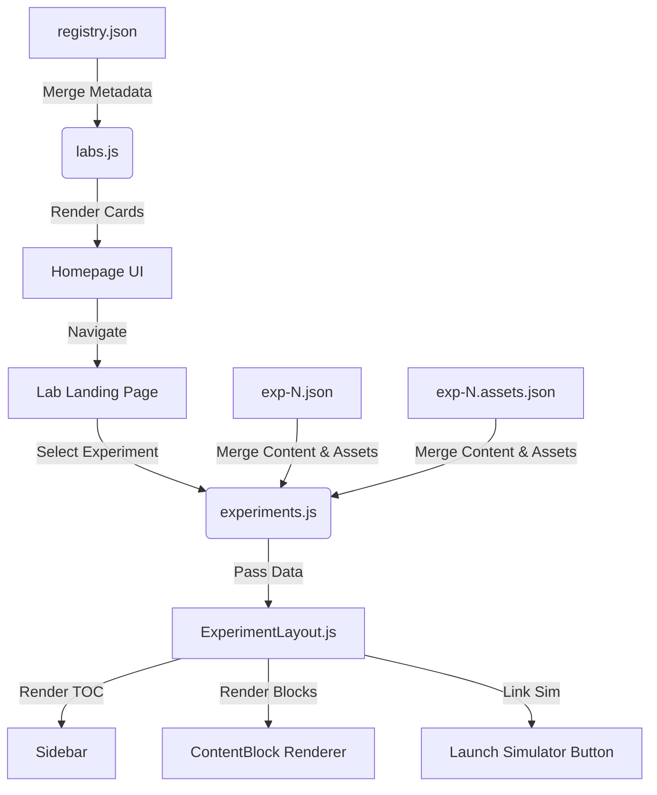

# 🎓 Bhilai EE Labs Guide

A structured, state-of-the-art virtual laboratory platform designed for **Electrical & Electronics Engineering** students at IIT Bhilai. Provides comprehensive experiment guides with observations, circuit diagrams, mathematical equations, and one-click access to interactive circuit simulators.

**Live Platform →** [bhilaee-labs.vercel.app](https://bhilaee-labs.vercel.app)  
**Companion Simulator →** [Bhilai EE Circuit Simulator](https://bhilaee-simulator.vercel.app) · [Repository](https://github.com/RavikantiAkshay/basic-simulator)

---

## ✨ Key Features

### 🧩 Intuitive Dashboard & Lab Cards
- **Visual Lab Cards:** The homepage features beautifully designed cards for all 9 labs, complete with distinct SVG icons (e.g., Bolt for Basic EE, Chip for Digital Electronics), lab codes, and experiment counts to provide at-a-glance information.
- **Personalized Pinning:** Users can pin their most-used labs to the top of the dashboard for quick access. Pinned labs are visually distinguished with a subtle premium gradient and a pinning indicator.
- **Cross-Lab Search:** A powerful, real-time search bar allows students to find specific experiments instantly across all modules, bypassing the need to click through multiple pages.

### 📄 Rich & Interactive Experiment Content
- **Comprehensive Formatting:** Experiments are far more than just text. They include responsive tables, syntax-highlighted code blocks, and complex mathematical formulas rendered beautifully using **KaTeX**.
- **Integrated Assets & Media:** Circuit diagrams, Simulink models, oscilloscope waveforms, and FFT analysis plots are seamlessly embedded and managed via a robust sidecar asset registry.
- **Standardized Viva Voce:** Pre-lab and post-lab Q&A sections feature highly readable, accent-bordered styling to help students easily digest key concepts and prepare for evaluations.
- **Print-Optimized:** A dedicated print mode strips away standard UI elements (headers, footers, sidebars) and adjusts layouts to generate flawless PDF reports or physical printouts directly from the browser.

### ⚡ One-Click Simulator & Data Visualization
- **Bridging Guide and Practice:** Experiments marked as "Simulation Available" feature a launch button that instantly boots up the companion React-based circuit simulator, automatically pre-loading the exact circuit template needed for the experiment.
- **Data Visualization:** Built-in interactive charting capabilities powered by **Chart.js** (with zoom plugins) allow for deep analysis of hardware and software-oriented lab results.

### 🌓 Modern User Experience
- **Dark/Light Mode Support:** First-class support for both light and dark themes, dynamically adjusting syntax highlighting, card gradients, and background aesthetics to reduce eye strain in low-light environments.
- **Authentication & Sync:** Backend integration powered by **Supabase**, enabling user profiles, secure login, feedback/support ticketing, and seamless syncing of pinned labs and preferences across devices.

---

## 🏗️ Architecture & Data Flow

### Architecture Overview



### Page Hierarchy

| URL Path | Renders |
|-------------|---------|
| `/` | Homepage with 9 interactive lab cards + cross-lab search |
| `/lab/[slug]` | Lab Landing Page listing all available experiments with status badges |
| `/lab/[slug]/experiment/[id]` | Full Experiment Guide Page with rich content rendering |

### Data Flow

1. **Initialization:** `labs.js` reads the master `registry.json` and merges it with static lab metadata (codes, descriptions, prerequisites).
2. **Navigation:** The user clicks an experiment card on a Lab Landing Page.
3. **Data Fetching:** `experiments.js` dynamically reads the corresponding `exp-N.json` and its sidecar asset file `exp-N.assets.json` using `fs.readFile`.
4. **Rendering:** `ExperimentLayout.js` parses the structural JSON into distinct React `ContentBlock` components.

---

## 🗂️ Registry (`registry.json`)

The master index mapping all labs to their experiments. It determines which experiments are visible and what status badge they carry:

| Status | Badge Color | Meaning |
|--------|:-----------:|---------|
| `Simulation Available` | Green | Has a linked interactive simulation |
| `Hardware-Oriented` | Orange | Hardware-only setup, no web simulation |
| `Software-Oriented` | Blue | Software/MATLAB/FPGA-based experiment |
| `Guide Only` | Gray | Documentation only, or work-in-progress |

---

## ⚙️ Experiment JSON Schema

Every experiment follows a strict scalable structure defined in `experiment_schema.js`. Sections are always rendered in a fixed pedagogical order:

> **Aim → Apparatus & Software → Theory → Pre-Lab / Circuit Diagram → Procedure → Simulation / Execution → Observations → Calculations → Results & Analysis → Conclusion → Post-Lab / Viva Voce → References & Resources**

### Content Block Types
The `content` array inside each section leverages modular rendering:
- `text`: Rich markdown-style text.
- `list`: Ordered / unordered step-by-step guides.
- `table`: Data tables with horizontal scroll support.
- `image`: Images mapped from the asset registry.
- `equation`: LaTeX math blocks.
- `code`: Syntax-highlighted snippets.

---

## 🖼️ Asset System

Images (e.g., Simulink models, waveforms) are managed via a sidecar JSON concept.
For `exp-9.json`, an `exp-9.assets.json` file is created containing relative paths and alt text. The `ImageBlock` component dynamically resolves these IDs into actual `public/assets/labs/` routes, ensuring zero broken links and clean separation of text content from media.

---

## 🔌 Simulator Integration

To make an experiment launchable from the guide:
1. **Create the template** in the simulator app.
2. **Update the experiment JSON** in this Guide app:
   - Set `"status": "Simulation Available"`
   - Add `"simulationId": "<expId>"` to the `meta` object.
   - Set `"route": "default"` in the `simulation` section.
3. Automatically, a "Launch Simulator" button appears, passing the template ID via URL parameters directly to the companion app.

---

## 📊 Content Progress

Our digitization effort is ongoing. Here is the current progress of experiment guides available on the platform:

| Lab | Code | Total | Complete | Simulation |
|-----|------|:-----:|:--------:|:----------:|
| Basic Electrical Engineering | EEL101 | 9 | **7** | 6 |
| Digital Electronics | EEP210 | 8 | **8** | — |
| Devices and Circuits | EEP209 | 8 | **6** | 5 |
| Power System Lab | EEP305 | 10 | **3** | 3 |
| Instrumentation Lab | EEP307 | 10 | **5** | — |
| Control System Lab | EEP308 | 10 | **1** | — |
| Machines Lab | EEP306 | 10 | **1** | 1 |
| Sensor Lab | EEP304 | 10 | 0 | — |
| Power Electronics Lab | EEP309 | 10 | 0 | — |

---

## 🛠️ Tech Stack

| Layer | Technology | Function |
|-------|------------|----------|
| **Core Framework** | Next.js 15 (App Router) | Server-side rendering, routing |
| **UI & Styling** | React 19 + CSS Modules | Component architecture, scoped styles |
| **Backend & Auth** | Supabase | User profiles, database, auth |
| **Math & Data** | KaTeX, Chart.js | Equations, interactive graphs |
| **Data Layer** | Static JSON | Fast, scalable, local file-system DB |
| **Deployment** | Vercel | Edge routing, CI/CD |

---

## 🚀 Getting Started

```bash
# 1. Clone the repository
git clone https://github.com/RavikantiAkshay/basic-lab-guide.git
cd basic-lab-guide

# 2. Install dependencies
npm install

# 3. Configure environment variables (Simulator & Supabase URL/Keys)
cp .env.example .env.local
# Add your NEXT_PUBLIC_SIMULATOR_URL, NEXT_PUBLIC_SUPABASE_URL, NEXT_PUBLIC_SUPABASE_ANON_KEY

# 4. Run the development server
npm run dev
```

Open [http://localhost:3000](http://localhost:3000) to view the application.

---

*For Internal Use — Department of Electrical Engineering, IIT Bhilai*