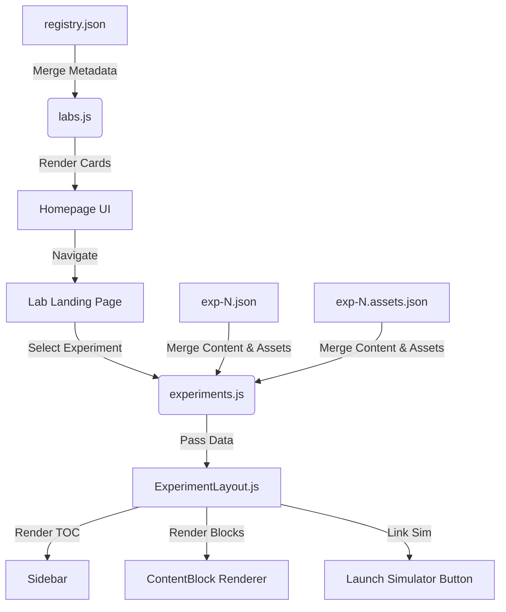

# 🎓 Bhilai EE Labs Guide & Platform

A sophisticated, feature-rich virtual laboratory platform designed for **Electrical & Electronics Engineering** students at IIT Bhilai. This platform provides comprehensive, beautifully structured experiment guides alongside powerful cloud-synced productivity tools, and one-click access to interactive circuit simulators.

**Live Platform →** [bhilaee-labs.vercel.app](https://bhilaee-labs.vercel.app)  
**Companion Simulator →** [Bhilai EE Circuit Simulator](https://bhilaee-simulator.vercel.app) · [Repository](https://github.com/RavikantiAkshay/basic-simulator)

---

## ✨ Comprehensive Feature Suite

Bhilai EE Labs is more than just a document viewer. It is a fully integrated educational workspace equipped with advanced tools to streamline the lab experience. 

### 🏠 Intelligent Dashboard & Navigation
- **Visual Lab Cards:** The homepage features beautifully refined cards for all 9 labs, displaying distinct SVG icons (Bolt, Chip, Tower, etc.), course codes, and experiment counts at a glance.
- **Pinned Labs:** Users can personalize their dashboard by "pinning" their most-used labs to the top. Pinned labs feature a premium visual gradient and indicator for instant access.
- **Platform Guide Tour (`PlatformGuideModal`):** A fully interactive onboarding modal accessible from the homepage teaser or the User Profile Menu. It walks new users through the platform's features step-by-step.
- **Cross-Lab Search:** A powerful, real-time search engine on the homepage allows students to find specific experiments instantly across all modules.

### ☁️ Cloud-Synced User Tools (Powered by Supabase)
Through seamless Supabase backend integration, authenticated students get access to a persistent, device-agnostic study environment accessible via the **User Profile Menu**:
- **⭐ Starred Experiments:** Students can bookmark vital experiments. These are saved to the cloud and instantly accessible via the dedicated `/starred` page for quick revision.
- **🕒 Recently Viewed History:** The platform automatically tracks and syncs the last 10 viewed experiments (`/history`), allowing users to easily resume their work across desktop and mobile.
- **📊 Saved Observations:** A built-in digital notebook (`/observations`) where students can record their experimental values, custom notes, and calculation results tied directly to specific experiments.
- **⚙️ User Preferences:** A dedicated settings hub (`/preferences`) where users govern their default landing lab, preferred theme (Dark/Light), pinned dashboard labs, and active notification settings.
- **💬 Support Hub:** An integrated ticketing system (`/support`) empowering users to report bugs, suggest platform features, or request help with specific experiments.

### 📚 Study & Revision Aids
- **🧠 Viva & Glossary Prep:** A centralized dictionary (`/glossary`) aggregating all critical terms, definitions, and Viva Voce questions across all labs into one searchable interface.
- **🖼️ Circuit Diagram Gallery:** A dedicated visual browser (`/gallery`) allowing students to easily search and review high-resolution circuit diagrams, topologies, and MATLAB/Simulink models without navigating individual experiment pages.

### 📄 Rich Experiment Content Rendering
- **Advanced Formatting:** Experiments are structured securely using Next.js Server Components. They support rich markdown, syntax-highlighted code blocks, responsive data tables with horizontal scroll, and complex mathematical formulas rendered beautifully via **KaTeX**.
- **Standardized Viva Voce:** Built-in Pre-lab and Post-lab Q&A sections feature highly readable, accent-bordered styling to help students digest concepts effortlessly.
- **Dynamic Asset Management:** Circuit diagrams, waveforms, and FFT plots are mapped dynamically via sidecar JSON files (`exp-N.assets.json`), ensuring broken links are a thing of the past.
- **Print & PDF Optimization:** A dedicated print mode strips away standard UI elements (headers, footers, sidebars, navigation) and adjusts container widths to generate flawless PDF reports or physical printouts directly from the browser.

### ⚡ Simulators & Data Visualization
- **One-Click Simulator Launch:** Experiments marked "Simulation Available" feature a Launch Button that instantly boots up the companion React circuit simulator, automatically injecting the exact circuit template needed via URL parameters.
- **Interactive Charting:** Built-in data visualization powered by **Chart.js** (complete with zoom plugins) allows students to deeply analyze structural densities, cycle counts, or hardware output waveforms dynamically.

### 🌓 Aesthetic Flexibility
- **Dark/Light Mode:** First-class support for both light and dark themes spanning across every UI component, ensuring accessibility and reducing eye strain in low-light environments.

---

## 🏗️ Architecture & Data Flow



### Data Flow Overview

1. **Initialization:** `labs.js` parses the master `registry.json` and marries it with static lab metadata.
2. **Navigation:** Users click a lab or utilize the global search or History/Starred shortcuts.
3. **Data Fetching:** `experiments.js` dynamically reads the corresponding `exp-N.json` and its sidecar asset file `exp-N.assets.json` at generation time using `fs.readFile`.
4. **Rendering Ecosystem:** `ExperimentLayout.js` parses the structural JSON into distinct React `ContentBlock` components.

---

## 🗂️ Registry (`registry.json`)

The master index mapping all labs to their experiments. It determines which experiments are visible and delegates the respective Status Badges:

| Status Badge | Color Indication | Meaning |
|--------------|:----------------:|---------|
| `Simulation Available` | Green | Has an interactive web simulation linked |
| `Hardware-Oriented` | Orange | Physical lab setup; no web simulation available |
| `Software-Oriented` | Blue | Software/MATLAB/FPGA-based experiments |
| `Guide Only` | Gray | Documentation only, or actively in development |

---

## ⚙️ Experiment JSON Schema

Every experiment follows a strict, scalable structure defined in `experiment_schema.js`. Sections are intentionally placed in a fixed pedagogical order:

> **Aim → Apparatus & Software → Theory → Pre-Lab / Circuit Diagram → Procedure → Simulation / Execution → Observations → Calculations → Results & Analysis → Conclusion → Post-Lab / Viva Voce → References & Resources**

### Content Block Capabilities
The `content` array inside each section leverages modular rendering blocks:
- `text`: Rich markdown-enabled text parsing.
- `list`: Nested ordered / unordered guides.
- `table`: Advanced data tables.
- `image`: Relative asset resolution from the asset registry.
- `equation`: LaTeX math blocks.
- `code`: Multi-language syntax highlighting.

---

## 📊 Content Digitization Progress

Our ambitious digitization effort is ongoing. Here is the accurate, current progress of completely published experiment guides on the platform:

| Lab | Code | Total | Complete | Simulation / Software |
|-----|------|:-----:|:--------:|:---------------------:|
| Basic Electrical Engineering | EEL101 | 9 | **9** | 7 |
| Digital Electronics | EEP210 | 8 | **8** | 1 |
| Devices and Circuits | EEP209 | 8 | **8** | 5 |
| Power System Lab | EEP305 | 10 | **6** | 6 |
| Sensor Lab | EEP304 | 9 | **9** | 2 |
| Control System Lab | EEP308 | 10 | **4** | 3 |
| Machines Lab | EEP306 | 10 | **7** | 1 |
| Instrumentation Lab | EEP307 | 10 | **5** | 0 |
| Power Electronics Lab | EEP309 | 10 | 0 | 0 |

---

## 🛠️ Technology Stack

| Layer | Technology | Function |
|-------|------------|----------|
| **Core Framework** | Next.js 15 (App Router) | Server-side rendering, routing engine |
| **UI & Styling** | React 19 + Native CSS Modules | Component rendering, scoped styling |
| **Backend & Auth** | Supabase | User profiles, database state syncing, auth |
| **Math & Visuals** | KaTeX, Chart.js, react-chartjs-2 | Complex equations, interactive canvas graphs |
| **Data Layer** | Static JSON Architectonics | Extremely fast, static, local file-system DB |
| **Deployment** | Vercel | Global edge routing, automated CI/CD pipelines |

---

## 🚀 Getting Started Locally

```bash
# 1. Clone the repository
git clone https://github.com/RavikantiAkshay/basic-lab-guide.git
cd basic-lab-guide

# 2. Install dependencies
npm install

# 3. Configure environment variables
# Copy the example and inject your Supabase & Simulator URLs
cp .env.example .env.local

# 4. Spin up the development server
npm run dev
```

Open [http://localhost:3000](http://localhost:3000) to view the application in action.

---

*For Internal Use — Department of Electrical Engineering, IIT Bhilai*